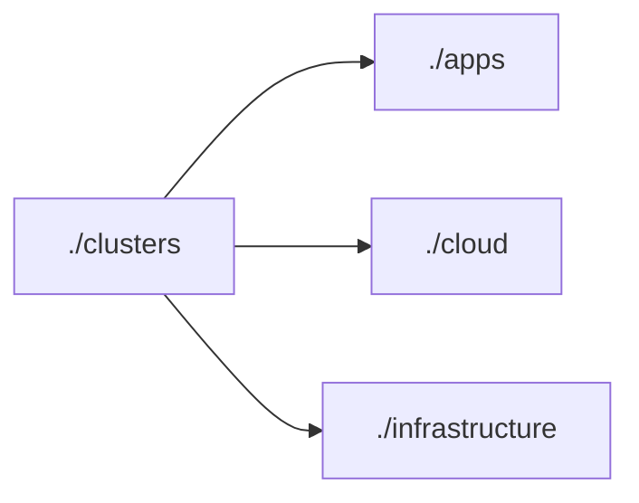
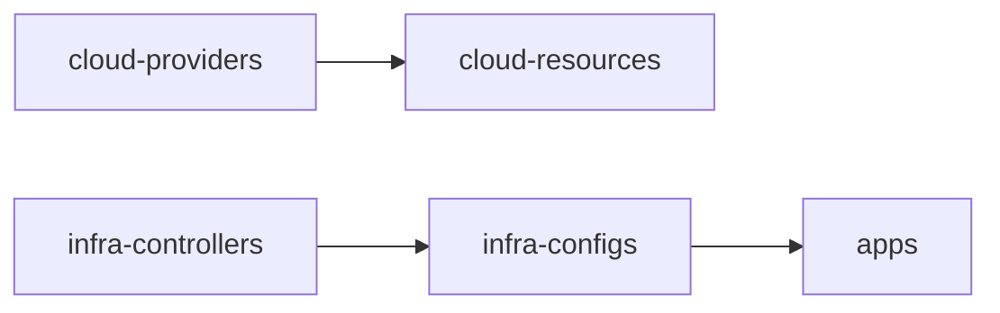

# gitops

[](https://github.com/darioblanco/gitops/actions/workflows/e2e.yaml)
[](https://github.com/darioblanco/gitops/actions/workflows/json.yaml)
[](https://github.com/darioblanco/gitops/actions/workflows/validate.yaml)
[](https://github.com/darioblanco/gitops/actions/workflows/yaml.yaml)

Apply GitOps to everything with [Flux](https://fluxcd.io/) and [Crossplane](https://www.crossplane.io/).

See my blogpost [Streamline Kubernetes Management: GitOps with Flux and Kustomize](https://medium.com/@dariobit/streamline-kubernetes-management-gitops-with-flux-and-kustomize-52300168c1c8) for more details.

Run `make help` for a list of commands.

## Architecture

The idea is to have a single Kubernetes cluster for everything
(e.g. your applications, infrastructure that support them and cloud configuration)
but in different environments, so changes can be thoroughly testing locally in a
dev environment or in your cloud provider of choice, using a `staging` environment.

Therefore, the `./clusters` folder hold the flux resources with kustomize that will
bootstrap each environment cluster. Those resources point to the respective `./apps`, `./cloud` and
`./infrastructure` folders respectively:



Each cluster bootstraps those components in the following order:



Once the components are bootstrapped, they will reconcile with the folders from the
repo they point at, to keep the configuration from git consistent with the state
of the cluster, which is the essence of GitOps.

## Repository structure

The Git repository contains the following top directories:

- [apps](./apps/README.md): `helm` and `kustomize` releases with a custom configuration and selection per environment. They depend on the addons and configs.
- [cloud](./cloud/README.md): any cloud resource that does not belong to Kubernetes and is managed via Crossplane.
- [clusters](./clusters/README.md): `flux` configuration per Kubernetes cluster environment that are used for their bootstrapping.
- [infrastructure](./infrastructure/README.md) common Kubernetes-specific infrastructure tools that are likely to be seen in multiple kubernetes clusters (e.g. `ingress-nginx` or `cert-manager`), and its configurations.
- scripts: utilities used by the `Makefile` and CI.

```text
├── apps
│   ├── base
│   ├── dev
│   ├── prod
│   └── staging
├── cloud
│   ├── providers
│   │   ├── base
│   │   ├── dev
│   │   ├── prod
│   │   └── staging
│   └── resources
│       ├── base
│       ├── dev
│       ├── prod
│       └── staging
├── clusters
│   ├── dev
│   ├── prod
│   └── staging
├── infrastructure
│   ├── configs
│   │   ├── base
│   │   ├── dev
│   │   ├── prod
│   │   └── staging
│   └── controllers
│       ├── base
│       ├── dev
│       ├── prod
│       └── staging
└── scripts
```

## Prerequisites

You can see the tooling needed to develop with this repository in the Makefile's `init` target.
Run `make init` to make sure that all prerequisites are fulfilled, and feel free to remove
prerequisites based on your personal needs.

- `age-keygen`: to provide an encryption backend to `sops` for securing secrets in the git repository.
- `flux`: the core requirement to enable GitOps in a Kubernetes cluster.
- `kind`: to provision a local Kubernetes cluster for testing.
- `kubeconform`: to lint Kubernetes manifests.
- `kubectl`: to interact with a Kubernetes cluster.
- `prettier`: to automatically format YAML and JSON files and ensure their style consistency.
- `sops`: to allow Flux the encryption and decryption of secrets.
- `yq`: to validate and interact with YAML files via the command line.

## Testing

Any change to the Kubernetes manifests or to the repository structure should be validated in CI before
a pull requests is merged into the main branch and synced on the cluster.

This repository contains the following GitHub CI workflows:

- the [validate](./.github/workflows/validate.yaml) workflow validates the Kubernetes manifests and Kustomize overlays with [kubeconform](https://github.com/yannh/kubeconform)
- the [e2e](./.github/workflows/e2e.yaml) workflow starts a Kubernetes cluster in CI and tests the `dev` setup (`dev`) by running Flux in Kubernetes Kind.

## Secrets

Secrets encryption is done with `Mozilla SOPS` and `age` as its backend, at client level:

- [Using SOPS with age and git like a pro](https://devops.datenkollektiv.de/using-sops-with-age-and-git-like-a-pro.html)
- [Encrypted GitOps secrets with flux and age](https://major.io/p/encrypted-gitops-secrets-with-flux-and-age/)

To be able to decrypt secrets, you need to have a private file per cluster. The private file
has to be stored in `./cluster/{clusterName}/sops.agekey`.

### Generate a private key per cluster

Each cluster folder in `./clusters/` should have a git ignored `sops.agekey` file, whose public key
is listed in `./.sops.yaml` with a path_regex that involves files that only belong to that cluster.

You can generate a key like this:

```sh
# One key per file
age-keygen > clusters/dev/sops.agekey
# You can also append multiple keys to a single file, that also works
age-keygen >> clusters/dev/sops.agekey
```

You should have a file there with a format like this:

```sh
$ cat sops.agekey
# created: 2023-07-17T14:07:50+02:00
# public key: age1v6q8sylunaq9m08rwxq702enmmh9lama7sp47vkcw3z8wm74z39q846s3y
AGE-SECRET-KEY-THIS_IS_A_SECRET_THAT_SHOULD_NEVER_BE_PUSHED
```

Normally, you would need to put an `AGE-SECRET-*` value that is shared within your team. The
`sops.agekey` file will never be pushed to the repo as it is git ignored.

The public key of this file should be added to the relevant `.sops.yaml` entries.

### Encrypt Kubernetes secrets

The encrypt command with `sops` is easy because the `.sops.yaml` configuration file already
points to the age public key based on the path of the target file. As the files to be encrypted
are always divided by cluster, `sops` know which public key to use thanks to that config.

In addition, the `sops` configuration defines an `encrypted_regex` so it will only encrypt the
`data` and `stringData` attributes, that are only found in Kubernetes secrets.

Therefore, to encrypt a secret resource so it can be pushed to the repo:

```sh
sops -e secret.yaml > secret.enc.yaml
```

Always make sure that the secrets you push to the repo are encrypted!

It is safe to run this command because `secret-values.yaml` are always git ignored.

NOTE: make format has to be run because SOPS create yaml files that do not follow the .editorconfig standard.
You can run it manually or the git hook will.

Alternatively, you can achieve the same (encryption + formatting) through the `encrypt.sh` script:

```sh
$ ./scripts/encrypt.sh secret.yaml
secret.enc.yaml 20ms
✅ Encrypted file saved to secret.enc.yaml
```

### Decrypt Kubernetes secrets

With the environment variables loaded (`source .envrc`), you can decrypt specific attributes from the YAML:

```sh
$ sops -d --extract '["data"]' secret.yaml
foo: ValueThatWasEncrypted
```

Alternatively, you can decrypt and store the decrypted files with this script:

```sh
$ ./scripts/decrypt.sh secret.enc.yaml
✅ Decrypted file saved to secret.yaml
```

## Run Kubernetes locally

Kind allows you to create production-like Kubernetes cluster in your own computer.

### Creating local Kubernetes clusters

See [creating a cluster](https://kind.sigs.k8s.io/docs/user/quick-start/#creating-a-cluster) in Kind's documentation.

For instance, to create two local clusters
(`production` and `staging` with the `kind-prod` and `kind-staging` contexts respectively)

```sh
$ kind create cluster --name crossplane --config kind.config.yaml
$ kind create cluster --name production --config kind.config.yaml
$ kind create cluster --name staging --config kind.config.yaml
$ kind get clusters
crossplane
production
staging
```

To switch between clusters:

```sh
# kubectl will connect to the crossplane cluster and create its context
kubectl cluster-info --context kind-crossplane
# kubectl will connect to the production cluster and create its context
kubectl cluster-info --context kind-prod
# kubectl will connect to the staging cluster and create its context
kubectl cluster-info --context kind-staging
```

To view the available contexts:

```sh
$ kubectl config get-contexts
CURRENT   NAME           CLUSTER        AUTHINFO       NAMESPACE
*         kind-staging   kind-staging   kind-staging   flux-system
```

Alternatively, you can use a tool like `kubectx` to manage contexts (`brew install kubectx`):

```sh
$ kubectx
kind-crossplane
kind-prod
kind-staging
$ kubectx kind-prod
Switched to context "kind-prod".
```

### Accessing a local cluster

You can access the cluster using `kubectl`. Make sure you have selected the proper context.

For instance:

```sh
kubectx kind-staging
kubectl get namespaces
```

### Using the ingress from a local cluster

Due to current limitations with `kind`, the local port in which you can access the
ingress controller from the cluster might vary, depending on the node in which
the `ingress-nginx` controller ends up.

You can check the forwarded ports in `kind.config.yaml`.

In addition, to ease the management of virtual hostnames you can run `make hosts`, which
will add entries from the exposed services in the cluster into your `/etc/hosts` file.
Once added, you can browse <http://{serviceName}.local:8080> (or port 8081, 8082, depending on the
worker node in which the `ingress-nginx` controller is).

For instance: <http://podinfo.local:8080>

### Deleting a local cluster

To delete a `kind` cluster:

```sh
kind delete cluster --name myname
```

## References

- [Flux2 Example](https://github.com/fluxcd/flux2-kustomize-helm-example)
- [How to apply GitOps to everything with Crossplane and Flux](https://www.cncf.io/blog/2022/07/26/how-to-apply-gitops-to-everything-with-crossplane-and-flux/)
